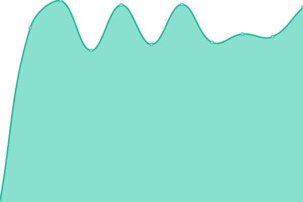

# [📈 Live Status](https://hermesthecat.github.io/hermes-uptime): <!--live status--> **🟧 Partial outage**

This repository contains the open-source uptime monitor and status page for [abdullah azad](http://abdullahgok.com.tr), powered by [Upptime](https://github.com/upptime/upptime).

With [Upptime](https://upptime.js.org), you can get your own unlimited and free uptime monitor and status page, powered entirely by a GitHub repository. We use [Issues](https://github.com/hermesthecat/hermes-uptime/issues) as incident reports, [Actions](https://github.com/hermesthecat/hermes-uptime/actions) as uptime monitors, and [Pages](https://hermesthecat.github.io/hermes-uptime) for the status page.

<!--start: status pages-->
<!-- This summary is generated by Upptime (https://github.com/upptime/upptime) -->
<!-- Do not edit this manually, your changes will be overwritten -->
<!-- prettier-ignore -->
| URL | Status | History | Response Time | Uptime |
| --- | ------ | ------- | ------------- | ------ |
|  [plesk istanbul](https://istanbul.abdullahazad.com) | 🟩 Up | [plesk-istanbul.yml](https://github.com/hermesthecat/hermes-uptime/commits/HEAD/history/plesk-istanbul.yml) | 

 535ms
     
 | 

<a href="https://uptime.abdullahazad.com/history/plesk-istanbul">100.00%</a>
    

|  [T.A.R.L.A. WEB](https://tarla.org.tr) | 🟩 Up | [t-a-r-l-a-web.yml](https://github.com/hermesthecat/hermes-uptime/commits/HEAD/history/t-a-r-l-a-web.yml) | 

 638ms
     
 | 

<a href="https://uptime.abdullahazad.com/history/t-a-r-l-a-web">100.00%</a>
    

|  [T.A.R.L.A. Mail](https://mail.tarla.org.tr) | 🟩 Up | [t-a-r-l-a-mail.yml](https://github.com/hermesthecat/hermes-uptime/commits/HEAD/history/t-a-r-l-a-mail.yml) | 

 634ms
     
 | 

<a href="https://uptime.abdullahazad.com/history/t-a-r-l-a-mail">100.00%</a>
    

|  [T.A.R.L.A. LDAP](http://ldap.tarla.org.tr) | 🟩 Up | [t-a-r-l-a-ldap.yml](https://github.com/hermesthecat/hermes-uptime/commits/HEAD/history/t-a-r-l-a-ldap.yml) | 

 376ms
     
 | 

<a href="https://uptime.abdullahazad.com/history/t-a-r-l-a-ldap">99.75%</a>
    

|  [T.A.R.L.A. Cloud](https://cloud.tarla.org.tr) | 🟥 Down | [t-a-r-l-a-cloud.yml](https://github.com/hermesthecat/hermes-uptime/commits/HEAD/history/t-a-r-l-a-cloud.yml) | 

 665ms
     
 | 

<a href="https://uptime.abdullahazad.com/history/t-a-r-l-a-cloud">83.04%</a>
    

|  [abdullah azad](https://abdullahazad.com) | 🟩 Up | [abdullah-azad.yml](https://github.com/hermesthecat/hermes-uptime/commits/HEAD/history/abdullah-azad.yml) | 

 567ms
     
 | 

<a href="https://uptime.abdullahazad.com/history/abdullah-azad">100.00%</a>
    

|  [Abdullah Gök](https:/abdullahgok.com.tr) | 🟩 Up | [abdullah-goek.yml](https://github.com/hermesthecat/hermes-uptime/commits/HEAD/history/abdullah-goek.yml) | 

 689ms
     
 | 

<a href="https://uptime.abdullahazad.com/history/abdullah-goek">100.00%</a>
    

|  [WhoIs Server](https://whois.abdullahazad.com) | 🟩 Up | [who-is-server.yml](https://github.com/hermesthecat/hermes-uptime/commits/HEAD/history/who-is-server.yml) | 

 1198ms
     
 | 

<a href="https://uptime.abdullahazad.com/history/who-is-server">100.00%</a>
    

|  [DNS Propagation Check](https://dnscheck.name.tr/) | 🟩 Up | [dns-propagation-check.yml](https://github.com/hermesthecat/hermes-uptime/commits/HEAD/history/dns-propagation-check.yml) | 

 715ms
     
 | 

<a href="https://uptime.abdullahazad.com/history/dns-propagation-check">100.00%</a>
    

<!--end: status pages-->

[**Visit our status website →**](https://hermesthecat.github.io/hermes-uptime)

## 📄 License

- Powered by: [Upptime](https://github.com/upptime/upptime)
- Code: [MIT](./LICENSE) © [abdullah azad](http://abdullahgok.com.tr)
- Data in the `./history` directory: [Open Database License](https://opendatacommons.org/licenses/odbl/1-0/)
