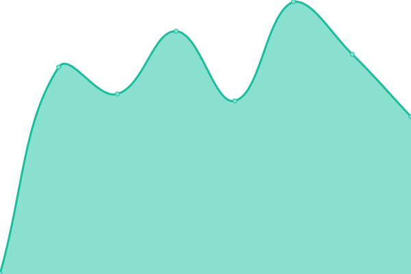
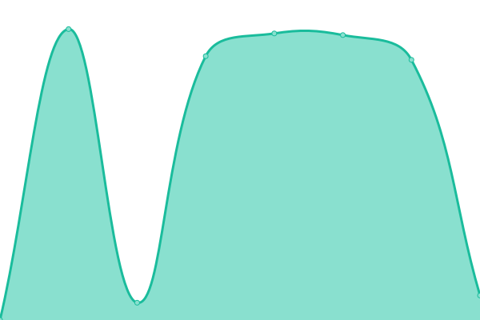

# [📈 Live Status](https://hermesthecat.github.io/hermes-uptime): <!--live status--> **🟧 Partial outage**

This repository contains the open-source uptime monitor and status page for [abdullah azad](http://abdullahgok.com.tr), powered by [Upptime](https://github.com/upptime/upptime).

With [Upptime](https://upptime.js.org), you can get your own unlimited and free uptime monitor and status page, powered entirely by a GitHub repository. We use [Issues](https://github.com/hermesthecat/hermes-uptime/issues) as incident reports, [Actions](https://github.com/hermesthecat/hermes-uptime/actions) as uptime monitors, and [Pages](https://hermesthecat.github.io/hermes-uptime) for the status page.

<!--start: status pages-->
<!-- This summary is generated by Upptime (https://github.com/upptime/upptime) -->
<!-- Do not edit this manually, your changes will be overwritten -->
<!-- prettier-ignore -->
| URL | Status | History | Response Time | Uptime |
| --- | ------ | ------- | ------------- | ------ |
|  T.A.R.L.A. WEB | 🟩 Up | [t-a-r-l-a-web.yml](https://github.com/hermesthecat/hermes-uptime/commits/HEAD/history/t-a-r-l-a-web.yml) | 

 2844ms
     
 | 

<a href="https://uptime.abdullahazad.com/history/t-a-r-l-a-web">100.00%</a>
    

|  T.A.R.L.A. EN WEB | 🟩 Up | [t-a-r-l-a-en-web.yml](https://github.com/hermesthecat/hermes-uptime/commits/HEAD/history/t-a-r-l-a-en-web.yml) | 

 3119ms
     
 | 

<a href="https://uptime.abdullahazad.com/history/t-a-r-l-a-en-web">100.00%</a>
    

|  T.A.R.L.A. Mail | 🟩 Up | [t-a-r-l-a-mail.yml](https://github.com/hermesthecat/hermes-uptime/commits/HEAD/history/t-a-r-l-a-mail.yml) | 

 783ms
     
 | 

<a href="https://uptime.abdullahazad.com/history/t-a-r-l-a-mail">100.00%</a>
    

|  T.A.R.L.A. LDAP | 🟩 Up | [t-a-r-l-a-ldap.yml](https://github.com/hermesthecat/hermes-uptime/commits/HEAD/history/t-a-r-l-a-ldap.yml) | 

 420ms
     
 | 

<a href="https://uptime.abdullahazad.com/history/t-a-r-l-a-ldap">100.00%</a>
    

|  T.A.R.L.A. Cloud | 🟥 Down | [t-a-r-l-a-cloud.yml](https://github.com/hermesthecat/hermes-uptime/commits/HEAD/history/t-a-r-l-a-cloud.yml) | 

 0ms
     
 | 

<a href="https://uptime.abdullahazad.com/history/t-a-r-l-a-cloud">100.00%</a>
    

|  T.A.R.L.A. Rapor | 🟥 Down | [t-a-r-l-a-rapor.yml](https://github.com/hermesthecat/hermes-uptime/commits/HEAD/history/t-a-r-l-a-rapor.yml) | 

 0ms
     
 | 

<a href="https://uptime.abdullahazad.com/history/t-a-r-l-a-rapor">100.00%</a>
    

|  T.A.R.L.A. Sınav | 🟥 Down | [t-a-r-l-a-sinav.yml](https://github.com/hermesthecat/hermes-uptime/commits/HEAD/history/t-a-r-l-a-sinav.yml) | 

 0ms
     
 | 

<a href="https://uptime.abdullahazad.com/history/t-a-r-l-a-sinav">100.00%</a>
    

|  T.A.R.L.A. Yardım Masası | 🟩 Up | [t-a-r-l-a-yardim-masasi.yml](https://github.com/hermesthecat/hermes-uptime/commits/HEAD/history/t-a-r-l-a-yardim-masasi.yml) | 

 2192ms
     
 | 

<a href="https://uptime.abdullahazad.com/history/t-a-r-l-a-yardim-masasi">100.00%</a>
    

|  T.A.R.L.A. EBYS | 🟩 Up | [t-a-r-l-a-ebys.yml](https://github.com/hermesthecat/hermes-uptime/commits/HEAD/history/t-a-r-l-a-ebys.yml) | 

 3651ms
     
 | 

<a href="https://uptime.abdullahazad.com/history/t-a-r-l-a-ebys">99.33%</a>
    

|  T.A.R.L.A. ERP | 🟩 Up | [t-a-r-l-a-erp.yml](https://github.com/hermesthecat/hermes-uptime/commits/HEAD/history/t-a-r-l-a-erp.yml) | 

 2051ms
     
 | 

<a href="https://uptime.abdullahazad.com/history/t-a-r-l-a-erp">100.00%</a>
    

<!--end: status pages-->

[**Visit our status website →**](https://hermesthecat.github.io/hermes-uptime)

## 📄 License

- Powered by: [Upptime](https://github.com/upptime/upptime)
- Code: [MIT](./LICENSE) © [abdullah azad](http://abdullahgok.com.tr)
- Data in the `./history` directory: [Open Database License](https://opendatacommons.org/licenses/odbl/1-0/)
