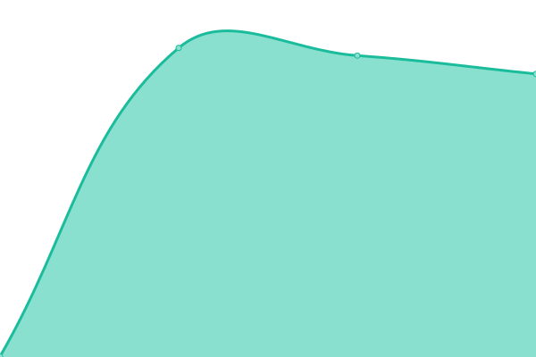

# [📈 Live Status](https://hermesthecat.github.io/hermes-uptime): <!--live status--> **🟩 All systems operational**

This repository contains the open-source uptime monitor and status page for [abdullah azad](http://abdullahgok.com.tr), powered by [Upptime](https://github.com/upptime/upptime).

With [Upptime](https://upptime.js.org), you can get your own unlimited and free uptime monitor and status page, powered entirely by a GitHub repository. We use [Issues](https://github.com/hermesthecat/hermes-uptime/issues) as incident reports, [Actions](https://github.com/hermesthecat/hermes-uptime/actions) as uptime monitors, and [Pages](https://hermesthecat.github.io/hermes-uptime) for the status page.

<!--start: status pages-->
<!-- This summary is generated by Upptime (https://github.com/upptime/upptime) -->
<!-- Do not edit this manually, your changes will be overwritten -->
<!-- prettier-ignore -->
| URL | Status | History | Response Time | Uptime |
| --- | ------ | ------- | ------------- | ------ |
|  [abdullahgok.com.tr](https:/abdullahgok.com.tr) | 🟩 Up | [abdullahgok-com-tr.yml](https://github.com/hermesthecat/hermes-uptime/commits/HEAD/history/abdullahgok-com-tr.yml) | 

 491ms
     
 | 

<a href="https://hermesthecat.github.io/hermes-uptime/history/abdullahgok-com-tr">100.00%</a>
    

|  [Hermes OWA](https://posta.hermes.name.tr) | 🟩 Up | [hermes-owa.yml](https://github.com/hermesthecat/hermes-uptime/commits/HEAD/history/hermes-owa.yml) | 

 1247ms
     
 | 

<a href="https://hermesthecat.github.io/hermes-uptime/history/hermes-owa">100.00%</a>
    

|  [GeoIP](https://geoip.abdullahazad.com) | 🟩 Up | [geo-ip.yml](https://github.com/hermesthecat/hermes-uptime/commits/HEAD/history/geo-ip.yml) | 

 606ms
     
 | 

<a href="https://hermesthecat.github.io/hermes-uptime/history/geo-ip">100.00%</a>
    

<!--end: status pages-->

[**Visit our status website →**](https://hermesthecat.github.io/hermes-uptime)

## 📄 License

- Powered by: [Upptime](https://github.com/upptime/upptime)
- Code: [MIT](./LICENSE) © [abdullah azad](http://abdullahgok.com.tr)
- Data in the `./history` directory: [Open Database License](https://opendatacommons.org/licenses/odbl/1-0/)
